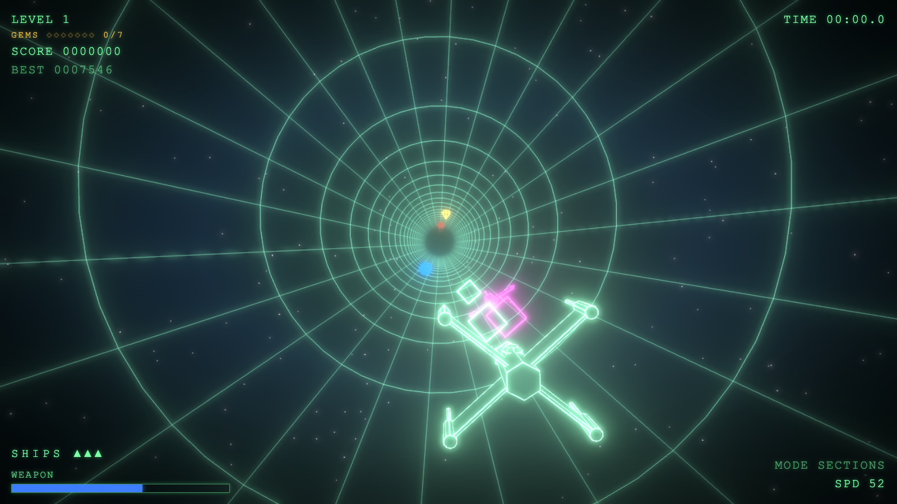

# Wormhole

> A small, polished neon vector flyer: pilot a lone craft down a wormhole through spacetime and chart how deep you can go.



Wormhole is set inside a tear in spacetime - a wormhole that opened with no way back,
where the deeper you fall, the slower time runs for you. You pilot a lone craft down
its throat, drawn as glowing neon wireframe on near-black, diving as far into the
unknown as you can hold the line. There is no finish, only how deep you get. It is
retro-INSPIRED, not retro-cheap: a modern machine doing a vector look, not a 1990s
mockup.

The soul of the game is the movement. The craft is not free-flying - it hangs near
the bottom of the tube under a gravity-like pull and steers only left / right,
climbing the curved wall like a pendulum. Pumping left-right-left builds amplitude
to ride high up the wall, or all the way over the top.

## Controls

| Action | Keys |
|--------|------|
| Steer / swing up the walls | Left / Right arrows, or A / D |
| Fire the forward gun | Space |
| Start / restart (after game over) | Space or Enter |
| Mute / unmute music (sound effects keep playing) | M |

You do not control speed - the tube section sets it (see Gameplay). Two extra keys
are for tuning rather than play: **G** cycles the flight mode and **P** toggles an
FPS / frame-time overlay.

## Gameplay

You only steer and shoot. Everything else flows from the swing.

- **Speed and feel come from the tube section.** Sections cycle slow -> normal ->
  fast and back. Slow sections pull hard and swing heavy (yellow walls), fast ones
  are light and floaty (blue walls), normal sits in between (green). The walls show
  the upcoming section's colour ahead of you.
- Energy drains continuously - ride into **blue orbs** to refill it.
- Ride into **gold gems** for score.
- Avoid **red spiky mines** - a hit costs one of your three ships, with brief
  invulnerability after.
- **Magenta raiders** fly in ahead, weave to stay hard to hit, then charge and fire
  back. Shoot them with the forward gun: a dead-centre hit destroys one outright, a
  glancing hit only chips it. A kill scores points and refunds some energy. Taking
  their bolt, or being rammed, costs a ship.
- Firing spends energy, so you cannot hold the trigger forever.
- The run ends when energy or ships run out. Your local best score persists.

## Running it

Requirements: Node.js + npm. Targets current Chrome and Safari on macOS.

```bash
npm install
npm run dev       # then open the printed localhost URL
```

Build a static, fully offline bundle:

```bash
npm run build     # output in dist/ - runs offline from a local folder
npm run preview
```

There is no backend and no accounts. The best score is kept in `localStorage`.

## Tech

TypeScript (strict) + Vite + Three.js. No game engine.

- The neon glow is GPU bloom (`UnrealBloomPass`), on by default - it is the look,
  not an afterthought.
- Glowing strokes use fat lines (`Line2`); the ship, wall objects (orbs, gems,
  mines), and raiders are edge-lit solids - glowing edges over a near-black fill -
  built procedurally in code so the whole game stays offline and on-aesthetic.
- The pendulum physics runs on a fixed timestep (semi-implicit Euler), decoupled
  from rendering, so the swing feels weighty and momentum-driven.
- Audio is Web Audio: a streamed music track plus procedural sound effects
  synthesised in code (no large asset files for the cues). Press M to mute the music.
- All feel constants live grouped in `src/config.ts` for fast tuning.

## Status

Early but playable.

- **Built**: scrolling wireframe tube, procedural edge-lit ship, damped-driven
  pendulum physics, banking chase cam; speed-tiered "sections" flight where the tube
  section sets both speed and gravity; energy orbs, treasure gems, and hazard mines
  on a generic "wall field" engine; a forward gun with pooled projectiles and magenta
  raiders that shoot back; lives with invulnerability; music and procedural sound
  effects; a minimal in-theme HUD, score with a persistent local best, and a
  deep-space backdrop with stars.
- **Next**: a difficulty ramp with distance - faster, denser fields and tighter gaps.

See [CLAUDE.md](CLAUDE.md) for the full design spec, physics model, architecture,
and roadmap.
